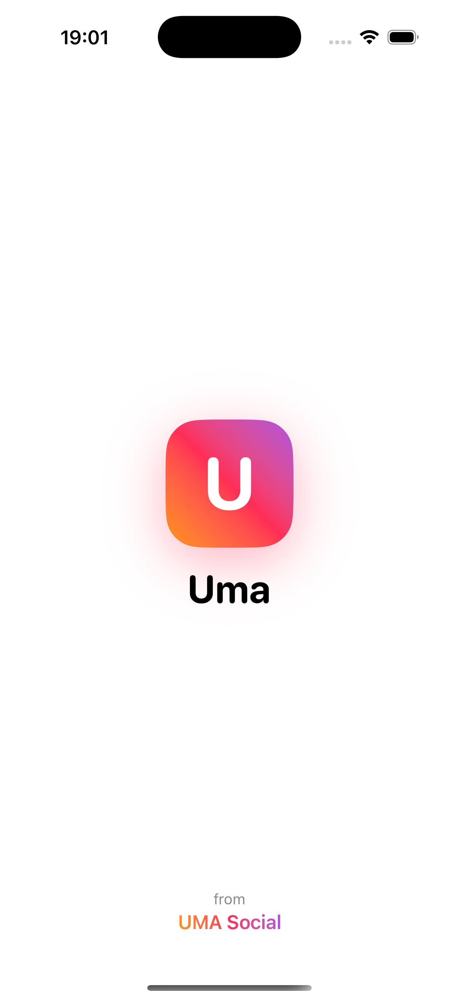
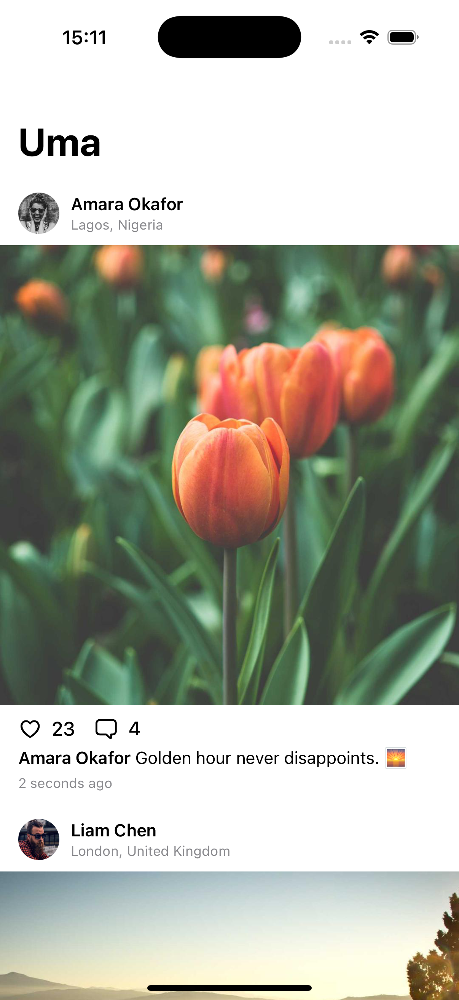
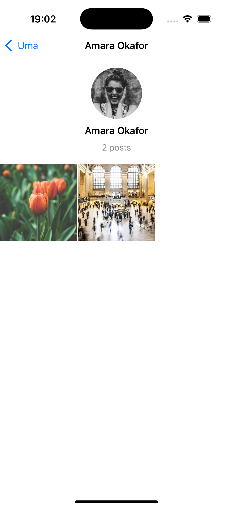
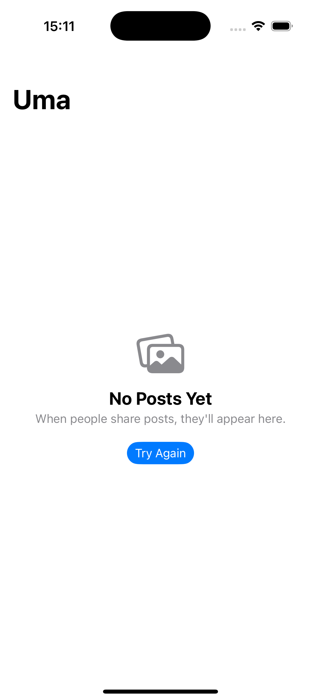

<div align="center">


# Uma

**A social feed for iOS, built with SwiftUI.**

Paginated posts, optimistic likes, offline caching and smooth, accessible motion, with no third-party dependencies.


</div>

<p align="center">
  
  
  
  
  
</p>

---

## Contents

- [Features](#features)
- [Getting Started](#getting-started)
- [Architecture](#architecture)
- [Project Structure](#project-structure)
- [Mock API](#mock-api)
- [Offline Behaviour](#offline-behaviour)
- [Technical Decisions](#technical-decisions)
- [Testing & Quality](#testing--quality)
- [Trade-offs & Roadmap](#trade-offs--roadmap)

---

## Features

### Feed
- **Rich posts.** Each post shows the author's name and avatar, the post text, an optional photo, location, relative time, and like and comment counts.
- **Infinite scroll.** The next page loads automatically when you reach the end of the feed. A page that fails to load shows an inline retry button.
- **Pull to refresh.** Swipe down to reload the feed from the first page.
- **Likes.** The heart updates instantly. If the request fails, the like is undone and the user sees a message. You can double-tap a photo to like it, and the button gives haptic feedback.

### Screen states
- **Loading:** a spinner while the first page loads.
- **Empty:** a message when there are no posts yet.
- **Offline:** a dedicated screen when there's no connection and nothing saved.
- **Error:** the error message with a retry button.
- **Offline banner:** shown at the top whenever the user is offline or viewing saved posts.

### Navigation
- **Feed → profile → post.** Tap an author to open their profile grid, then tap a tile to open that post.
- **Router-based.** A single `NavigationStack` is driven by a type-safe `Route` enum.

### Experience
- **Splash screen.** The brand mark animates in over the same background as the launch screen, so there's no visible jump between them.
- **App icon** in light, dark and tinted versions for iOS 18 home-screen styles.
- **Scroll effect.** Posts and profile tiles ease in as they enter from the bottom of the screen.
- **Accessibility.** Dynamic Type, Dark Mode, VoiceOver labels and hints, and Reduce Motion are supported.

---

## Getting Started

### Requirements

| Tool | Version |
| --- | --- |
| Xcode | 16.0 or later (built and tested with Xcode 26.3) |
| iOS deployment target | 17.0 |
| Swift | 6.0 language mode |
| Dependencies | None |

### Run the app

```bash
git clone https://github.com/Sampel65/UMA.git
cd UMA
open Uma.xcodeproj
```

Choose the **Uma** scheme and an iPhone simulator, then press **⌘R**.

> Photos and avatars load from public placeholder services (`picsum.photos`, `pravatar.cc`), so the first launch needs an internet connection. After that, images load from the disk cache.

### Run the tests

Press **⌘U** in Xcode, or run:

```bash
xcodebuild test \
  -project Uma.xcodeproj \
  -scheme Uma \
  -destination 'platform=iOS Simulator,name=iPhone 16 Pro'
```

### Try every state

The shared scheme includes launch arguments, turned off by default. Enable them under **Product → Scheme → Edit Scheme → Run → Arguments**.

| State | How to trigger it |
| --- | --- |
| Loading | Shown on every launch (the mock API adds 800 ms of latency). |
| Empty | Enable `-mockEmptyFeed YES`. |
| Error / retry | Enable `-mockFailureRate 0.5`. Each request then fails half the time with an HTTP 500. |
| Offline | Turn off your Mac's Wi-Fi; the simulator uses the Mac's connection. See [Offline Behaviour](#offline-behaviour). |

---

## Architecture

Uma uses **MVVM (Model–View–ViewModel) with a repository layer**, and the code is organised by feature rather than by file type. Each layer has one job and only talks to the layer directly below it, through a protocol. That keeps the UI independent of where the data comes from, and lets every layer be tested on its own.

### The four layers

**1. Presentation: what the user sees.**
SwiftUI views (`FeedView`, `PostCardView`, `ProfileView`, `PostDetailView`) only display state and pass user actions, like "like this post" or "load more", to the view model. They contain no business logic and never call the network.

`FeedViewModel` is an `@Observable` class that owns everything the feed screen needs: the list of posts and the current screen state. The state is a single enum: loading, loaded, empty, offline or failed. Because the screen can only be in one of those at a time, it can't show contradictory states, such as a spinner and an error together. The view model also handles pagination, pull-to-refresh and optimistic likes.

`Router` owns the navigation path. When a screen wants to navigate, it pushes a typed `Route` such as `.profile(author)`, and `RootView` decides which screen to show. Screens never create each other, so they stay loosely coupled.

**2. Domain: the app's own language.**
The plain models (`Post`, `Author`, `FeedPage`), the user-facing `FeedError`, and the `FeedRepository` protocol. This layer has no SwiftUI, no networking and no JSON. It describes *what* the app works with, not *how* data is fetched or stored.

**3. Data: where posts come from.**
`DefaultFeedRepository` implements `FeedRepository` and is the single source of truth. It asks the network first and saves each loaded page to a local cache. If the first page can't be fetched, it falls back to the cache, so the user still sees the saved feed offline.

Below it, `RemoteFeedService` speaks to the API. It converts raw API responses (DTOs, in snake_case JSON) into domain models, and network errors into domain errors. `APIClient` is a small reusable wrapper around `URLSession` that builds requests, checks status codes and decodes JSON. `FileFeedCache` stores the feed as a JSON file on disk.

**4. Mock backend: a stand-in server.**
`MockAPIURLProtocol` intercepts the app's HTTP requests, and `MockAPIServer` answers them from a bundled `posts.json`. To the rest of the app, this looks exactly like a real server. See [Mock API](#mock-api).

### How a request flows

Here's what happens when the feed first appears:

1. `FeedView` appears and asks `FeedViewModel` to load the first page.
2. The view model sets its state to *loading* (the view shows a spinner) and asks the `FeedRepository` for page 1.
3. `DefaultFeedRepository` asks `RemoteFeedService`, which builds a `GET /v1/posts?page=1&limit=10` request and sends it through `APIClient`.
4. The response JSON is decoded into DTOs, converted into domain `Post`s, and saved to the cache by the repository.
5. The view model receives the posts and sets its state to *loaded*. SwiftUI re-renders the feed automatically, because the view model is `@Observable`.

If the network is down in step 3, the repository returns the cached posts instead, and the view model shows them with an offline banner. If there's no cache either, the error travels back up as `FeedError.offline` and the view shows the offline screen.

### Dependency injection

All objects are created in one place, `UmaApp`, which is called the *composition root*, and are passed down through initializers. No layer creates its own dependencies, and there are no singletons in the feature code. Because of this:

- Tests swap in simple stubs (a fake repository, an in-memory cache) without any mocking framework.
- Moving from the mock API to a real backend is a one-line change in `UmaApp`.

### Layer responsibilities

| Layer | Responsibility |
| --- | --- |
| **Views** | Render state and forward user intents. No business logic. |
| **`FeedViewModel`** | Owns screen state as explicit enums (`State` and `PaginationState`), so the view can't show two conflicting states at once. Handles pagination, refresh and optimistic likes. |
| **`Router`** | Owns the navigation path. Screens ask to navigate by pushing a `Route`; they never construct other screens. |
| **`DefaultFeedRepository`** | Single source of truth. Fetches from the network first, saves every loaded page to the cache, and falls back to the cache when the first page fails. |
| **`RemoteFeedService`** | Converts API responses (DTOs) into domain models, and transport errors (`APIError`) into domain errors (`FeedError`). |
| **`APIClient`** | Reusable `URLSession` wrapper. Builds requests, validates status codes, decodes JSON and classifies network errors. |

---

## Project Structure

```
Uma.xcodeproj                     Xcode project + shared scheme
Uma/
├── App/
│   ├── UmaApp.swift              Composition root: wires up all dependencies
│   ├── RootView.swift            Splash overlay + NavigationStack + route mapping
│   └── Navigation/               Route (type-safe destinations), Router
├── Core/
│   ├── ImageLoading/             ImageLoader (actor, two-tier cache), RemoteImage
│   ├── Networking/               APIClient, Endpoint, JSON coders, NetworkMonitor
│   └── UI/                       ScrollEntranceEffect
├── Features/
│   ├── Feed/
│   │   ├── Domain/               Post, Author, FeedPage, FeedError, FeedRepository
│   │   ├── Data/                 FeedService, FeedCache, DefaultFeedRepository
│   │   │   └── Remote/           RemoteFeedService, DTOs + domain mapping
│   │   └── Presentation/         FeedViewModel
│   │       └── Views/            FeedView, PostCardView, ProfileView, PostDetailView
│   └── Splash/                   SplashView
├── MockAPI/                      posts.json, MockAPIServer, MockAPIURLProtocol
└── Resources/                    Asset catalog (app icon, accent colour)

UmaTests/                         Swift Testing suites + test doubles
docs/screenshots/                 Images used in this README
```

---

## Mock API

Uma makes **real HTTP requests** with `URLSession` and decodes the responses with `JSONDecoder`. The requests are answered by a mock backend that runs inside the app, so there's no server to host and no account to set up.

### Endpoints

| Method | Endpoint | Response |
| --- | --- | --- |
| `GET` | `/v1/posts?page={n}&limit={n}` | `200` with a paginated envelope |
| `POST` | `/v1/posts/{id}/like` | `204` |
| `DELETE` | `/v1/posts/{id}/like` | `204` |
| any | Invalid `page` or `limit` / unknown post or route | `400` / `404` |

Base URL: `https://api.uma.social`

### Response format

```json
{
  "data": [
    {
      "id": "post-1",
      "author": { "id": "user-1", "name": "Amara Okafor", "avatar_url": "https://…" },
      "text": "Golden hour never disappoints. 🌅",
      "media_url": "https://…",
      "location": "Lagos, Nigeria",
      "created_at": "2026-10-02T12:00:00Z",
      "like_count": 23,
      "comment_count": 4,
      "is_liked": false
    }
  ],
  "page": 1,
  "has_more": true
}
```

### How it works

- **`posts.json`** contains 42 seed posts, in the same snake_case format the API returns.
- **`MockAPIServer`** handles routing, pagination, input validation and like state. Its state is protected by `OSAllocatedUnfairLock`, so concurrent requests are safe.
- **`MockAPIURLProtocol`** is registered only on `URLSession.mockAPI` and intercepts requests to `api.uma.social`. It:
  - adds 800 ms of latency;
  - fails with `URLError.notConnectedToInternet` when the device is actually offline, just as a real request would;
  - returns random `500` errors when `-mockFailureRate` is set.

### Moving to a real backend

Change one line in `UmaApp`: pass the production base URL and `URLSession.shared` to `APIClient`, then delete `MockAPI/`. `RemoteFeedService`, the DTOs, the repository, the view models and the views stay the same.

---

## Offline Behaviour

| Situation | What the user sees |
| --- | --- |
| **First launch, no network** | A full-screen "You're Offline" message with **Try Again**. The feed loads by itself when the connection returns. |
| **Launch with no network, feed loaded before** | The saved feed, including the user's likes, with a "You're offline" banner. Previously seen images load from disk. Pagination is paused, and the feed refreshes automatically when the connection returns. |
| **Network drops while the app is open** | The banner appears and the posts stay on screen. Loading more shows an inline retry button. A like is undone and the user sees a message. |
| **Pull to refresh while offline** | The current posts stay on screen and an alert explains the problem. |

---

## Technical Decisions

<details open>
<summary><strong>Concurrency: Swift 6 strict mode</strong></summary>

The app uses Swift 6 language mode with strict concurrency checking, `MainActor` default isolation and approachable concurrency, which are Apple's current defaults for app targets.

- UI state stays on the main actor.
- Disk I/O (`FileFeedCache`) and image loading (`ImageLoader`) run on their own actors.
- Models are `nonisolated` and `Sendable`, so they can safely move between actors.
- The mock server protects its shared state with a lock.
</details>

<details>
<summary><strong>Navigation: router and type-safe routes</strong></summary>

- **One stack.** A single `NavigationStack` is owned by `RootView`, and its path is bound to an `@Observable` `Router`.
- **Typed destinations.** Destinations are a `Route` enum (`.profile(Author)` and `.post(id:)`), and `RootView` is the only place that turns a route into a screen.
- **Decoupled views.** Reusable views such as `PostCardView` only expose callbacks (`onAuthorTap`, `onLike`), so they don't depend on navigation.
- **Deep-link ready.** The path is plain `Hashable` data, so deep links and state restoration only need to set `router.path`.
- **Root-level alert.** The error alert is attached at the root, so it still appears while a pushed screen is on top.
</details>

<details>
<summary><strong>Pagination and race safety</strong></summary>

- A footer at the end of the `LazyVStack` starts loading the next page when it appears. It uses `.task(id: posts.count)`, so the request is cancelled automatically if the footer scrolls away. A cancelled request resets to `idle` rather than counting as an error.
- A **generation counter** makes the view model drop pages that belong to an older feed. A pull-to-refresh during pagination therefore can't add stale posts.
- Pages are **de-duplicated by ID**, so a post that moves between pages on the server isn't shown twice.
- The repository stores posts per page and **only caches pages that run continuously from page 1**, so the offline cache never has gaps or wrong ordering.
</details>

<details>
<summary><strong>Image caching</strong></summary>

`ImageLoader` is an actor with two cache tiers:

1. **Memory:** `NSCache` holds decoded, display-ready bitmaps (`byPreparingForDisplay()`), so scrolling stays smooth. It's limited by **byte cost (150 MB)** rather than image count, and it also evicts under memory pressure.
2. **Disk:** a dedicated `URLCache` (250 MB) with the `.returnCacheDataElseLoad` policy, so images seen before still load offline and after a relaunch.

- **Shared downloads.** Concurrent requests for the same URL share one in-flight task.
- **No reload flash.** `RemoteImage` skips work when it's already showing the requested URL, so cells scrolling back into view don't flash.
- **Swappable loader.** The loader comes from the SwiftUI environment, so previews and tests can replace it.
</details>

<details>
<summary><strong>Offline caching</strong></summary>

- **What's saved.** Loaded posts, including the user's likes, are written as JSON to the Caches directory by an actor.
- **Why a JSON file.** I chose it over SwiftData or Core Data on purpose: the cache is a disposable snapshot of the feed, not a store that needs queries or migrations.
- **Automatic recovery.** `NetworkMonitor` (`NWPathMonitor`) shows the offline banner and triggers a refresh when the connection returns.
</details>

<details>
<summary><strong>Error handling</strong></summary>

- **Two error types.** `APIError` covers transport problems, and `FeedError` covers domain errors with localised, user-facing messages. Views never see HTTP details.
- **Nothing on screen yet:** a failure shows a full-screen state with a retry button.
- **Content already on screen:** a failure from a refresh or a like shows an alert and keeps the content.
- **Cache failures** are logged with `OSLog` and never shown to the user.
</details>

<details>
<summary><strong>Optimistic likes</strong></summary>

- The UI updates immediately and rolls back if the request fails.
- Taps on a post that already has a like request in flight are ignored, so rapid taps can't leave the count out of sync.
- Every screen reads the same `FeedViewModel`, so a like shows up everywhere at once.
</details>

<details>
<summary><strong>Splash screen, app icon and motion</strong></summary>

- **Splash.** `SplashView` is drawn on the same background as the system launch screen, so the hand-off is invisible. The brand mark springs in and fades out after 1.4 seconds, while the feed loads underneath.
- **App icon.** It uses the splash's brand mark: a white rounded "U" on the purple-pink-orange gradient. There are light, dark and tinted versions.
- **Scroll effect.** The `scrollEntranceEffect()` modifier is built on `scrollTransition`, which applies visual effects without re-evaluating views or redoing layout. It only animates at the bottom edge, so a tall post never fades while you're still reading it.
- **Reduce Motion.** When it's on, movement and scaling are replaced by a simple fade.
</details>

---

## Testing & Quality

**26 unit tests** written with [Swift Testing](https://developer.apple.com/xcode/swift-testing/) (`@Test`, `#expect`). Each test builds its own stubs, so the tests don't depend on each other.

| Suite | What it covers |
| --- | --- |
| `FeedViewModelTests` | Loaded, empty, offline and error states; pagination until the last page; retrying a failed page; optimistic likes and rollback; navigation lookups; a refresh during pagination discards the stale page; duplicate posts are skipped |
| `DefaultFeedRepositoryTests` | Pages are cached; the first page falls back to the cache; errors are rethrown when the cache is empty; later pages never fall back; only contiguous pages are cached; likes are saved to the cache |
| `MockAPIServerTests` | Bundled JSON decodes; page slicing and `has_more`; `400` for invalid pagination; like endpoint updates state; `404` for an unknown post |
| `FeedDTOTests` | A snake_case response with ISO 8601 dates maps correctly to domain models |
| `RouterTests` | Pushing routes builds the navigation path in order |
| `PostTests` | Like count changes, setting the same like state twice has no effect, and posts survive a JSON round trip |

**Additional checks**

- ✅ Builds in Swift 6 strict concurrency mode with **no warnings**.
- ✅ Xcode's static analyzer (`xcodebuild analyze`) reports **no issues**.
- ✅ Apple's `leaks` tool reports **0 leaks** on the running app after paginating, liking and navigating back and forth repeatedly.

---

## Trade-offs & Roadmap

**Known trade-offs**

- **Pagination style.** Page numbers keep the mock simple. A production feed should use cursor-based pagination so that new posts don't shift the pages.
- **Profile data.** Profiles show only the posts already loaded in the feed. A dedicated profile endpoint and view model would show every post.
- **Cache size.** The offline cache stores every loaded post. Production would cap its size and expire old entries.
- **Static seed dates.** The mock data has fixed timestamps, so "time ago" labels get older over time.

**Roadmap**

- [ ] Retry a failed page automatically when the connection returns.
- [ ] Snapshot and UI tests for every screen state.
- [ ] Auth headers, plus retry with exponential backoff in `APIClient`.
- [ ] Downsample images to the size they're displayed at.
- [ ] Comments screen and post composer.

---

<div align="center">

Built by **Samson Oluwapelumi**

</div>
